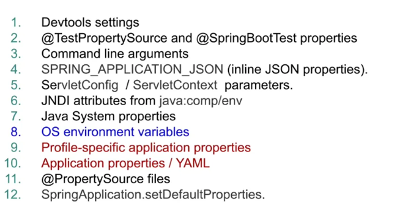

#  Introduction to Spring Boot

Welcome to the **Introduction to Spring Boot** presentation! 
This README summarizes our technical session, covering key concepts, 
hands-on demos, and best practices. 🚀

Slides
- [SpringBootPresentation.pdf](./SpringBootPresentation.pdf)

---

## 📝 Topics Covered

### 1. **Core Concepts of Spring Framework**
- **Dependency Injection**:  
  Explored different types:
  - Setter Injection
  - Constructor Injection
  - Field Injection
- **IoC (Inversion of Control) Container**:
  - `BeanFactory`
  - `ApplicationContext`
- **Key Components**:
  - Beans: XML, Java, Annotations
  - Autowiring: By Name, By Type
  - `CommandLineRunner` for application initialization

---

### 2. **🌟 Introduction to Spring Boot**
- **History of Spring Boot** ([SpringOne - History of Spring](https://springone.io/history-of-spring)):
  - A **predictable** and **opinionated** framework
- **Spring Boot Starters**:
  - Simplified dependency management with ~18 key starters.
- Explored [start.spring.io](https://start.spring.io):
  - A tool to bootstrap Spring applications effortlessly.

---

### 3. **Annotations Galore!**
#### 🌿 **Core Spring Annotations**
- `@Component`  
- `@Controller`  
- `@Autowired`  
- `@Qualifier`  
- `@Primary`  
- `@Aspect`  
- `@Bean`  
- `@PropertySource`
- ... (more)

#### 🚀 **Core Spring Boot Annotations**
- `@SpringBootApplication`
- `@EnableAutoConfiguration`
- `@RestController`
- `@RequestMapping`
- `@ResponseBody`
- `@PathVariable`
- `@Entity`
- `@SpringBootTest`
- ... (more)

---

### 4. **📂 Configuration & External Properties**
#### **Property Management**
- **Default Locations** for `application.properties`:
  1. `/config` sub-directory  
  2. Working directory  
  3. Classpath root (e.g., `src/main/resources`) ➡️ Most common  
- **Profiles**:
  - Named properties: `application-{profile}.properties`
  - Default: `application.properties` is always loaded.
  - Activate with:  
    ```properties
    spring.profiles.active=dev
    ```
  - Example:  
    ```properties
    # application-dev.properties
    server.port=8080
    myapp.backend.name=mybookapp
    myapp.backend.ipADDRESS=192.168.2.0
    ```

#### **Relaxed Binding**  
- Mapped configuration with minimal boilerplate using:
  ```java
  @Data // Lombok
  @ConfigurationProperties(prefix = "myapp.backend")
  // @Component or
  // @EnableConfigurationProperties(MyAppSetting.class) in the main class or
  // @ConfigurationPropertiesScan in the main class
  public class MyAppSetting {

      private String name;
      private String ipaddress;

      @PostConstruct
      public void printOut() {
          System.out.println("my app name: " + this.name);
          System.out.println("my app IP: " + this.ipaddress);
      }
  }


### 🌟 Demo: Bootstrap Your App!
We set up profiles and properties using a hands-on demo:
1. Activated Spring Profiles for dev
2. Configured application properties.
3. Explored how Spring Boot selects properties based on profiles.


### 🤔 Key Takeaways
1. Spring Boot simplifies application setup with:
    - Pre-configured defaults
    - Auto-configuration
    - Starter dependencies
2. Profiles and application.properties make configuration flexible and manageable.
3. Annotations are your best friends to minimize boilerplate code.
